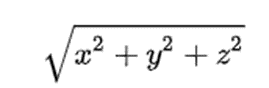

Занятие 1: Инкапсуляция, наследование, полиморфизм
1) Создать класс Cat с полями: имя,цвет,кол-во лет. Поработать с полями напрямую;
2) Данному классу добавить инкапсуляцию + сделать валидацию на введенный возраст;
3) Какой уровень доступа нам подойдет для родительского класса?

4) Создать родительский класс для класса Cat с методами :
   animalInfo()
   voice()
   jump()
   И унаследоваться от него
5) Переопределить методы у класса наследника (анотация - @override)
6) Практикуемся на задаче:

    Создайте систему управления банковскими счетами, где каждый счёт имеет свой номер, владельца и баланс.

    У него должны быть:
    - Аккаунт (включает в себя номер Аккаунта, имя владельца, баланс)
    - Унаследованные от аккаунта счета(аккаунты) (сберегательный, кредитный)
    - Main - класс, который и будет являться системой управления счетами.
    - реализовать методы:
    - deposit(amount) - метод для добавления денежных средств на счет. Принимает один аргумент - сумму депозита.
    - withdraw(amount) - метод для снятия денежных средств со счета. Принимает один аргумент - сумму снятия.
    (Выше реализованы представлены сигнатуры общих методов)

    Для сберегательного счёта:
    - addInterest() - метод для добавления процентов к балансу. 
    Рассчитывает процентную ставку от текущего баланса и добавляет полученную сумму к балансу.

    Для кредитного счёта:
    - calculate_interest() - метод для расчета процентов по кредиту. 
    - Должен рассчитывать процентную ставку от текущего баланса и вычитать полученную сумму из баланса. 
    - Если баланс отрицательный, то проценты начисляются на отрицательный баланс.
