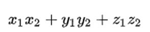
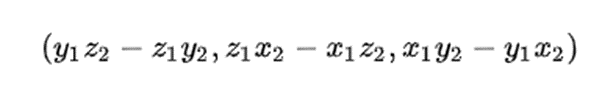
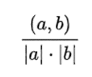
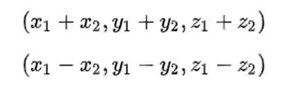

Занятие 1: Инкапсуляция, наследование, полиморфизм
1) Создать класс Cat с полями: имя,цвет,кол-во лет. Поработать с полями напрямую;
2) Данному классу добавить инкапсуляцию + сделать валидацию на введенный возраст;
3) Практикуемся на задаче:

   Создайте класс, который описывает вектор (в трёхмерном пространстве).

   У него должны быть:

   •	конструктор с параметрами в виде списка координат x, y, z
   •	метод, вычисляющий длину вектора. Корень можно посчитать с помощью Math.sqrt():

   

   •	метод, вычисляющий скалярное произведение:

   

   •	метод, вычисляющий векторное произведение с другим вектором:

   

   •	метод, вычисляющий угол между векторами (или косинус угла): 
        косинус угла между векторами равен скалярному произведению векторов,
        деленному на произведение модулей (длин) векторов:

   

   •	методы для суммы и разности:

   

4) Создайте систему управления банковскими счетами, где каждый счёт имеет 
   свой номер, владельца и баланса;
   
   У него должен быть:

   - Аккаунт (включает в себя номер Аккаунта, имя владельца, баланс)
   - Унаследование от аккаунта счета(аккаунты) (сберегательный, кредитный)
   - Main - класс, который и будет являться системой управления счетамию
   - реализовать методы:
     - deposit(amount) - метод для добавления денежных средств на счет.
   Принимает один аргумент - сумму депозита.
     - withdraw(amount) - метод для снятия денежных средств со счета.
   Принимает один аргумент - сумму снятия.
   (Выше реализованы представлены сигнатуры общих методов)
   
   Для сберегательного счета:
   - addInterest() - метод для добавления процентов к балансу. 
   Рассчитывает процентную ставку от текущего баланса и добавляет
   полученную сумму к балансу.